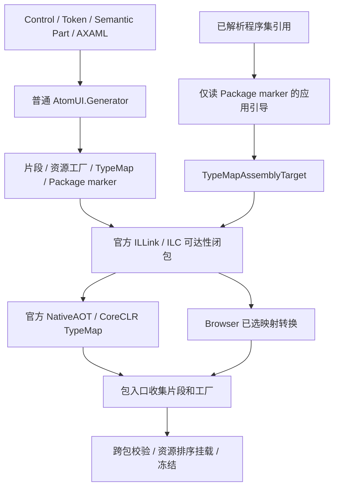

# AOT 与裁剪架构

本文是 AtomUI 控件自动注册与裁剪的总体架构、实施状态和产品交付门槛的正式所有者。

## 1. 状态与事实边界

**状态：TypeMap 主体源码迁移与旧注册路径退役已完成；资源平台声明收敛已实现；正式交付验收尚未完成，未发布。**

当前源码采用逐 Control 注册片段与独立主题资产，由官方链接器计算保留闭包。NativeAOT/CoreCLR 使用官方 TypeMap；
Browser/Mono 在官方 ILLink 标记之后将已选映射转换为静态映射。普通包入口、产品 buildTransitive 与独立冷 NuGet 消费
已经接入该实现。旧 usage、Sidecar、Unit、应用 Plan 与 LinkedPublish analyzer 已移除，没有可切回的 legacy backend。

2026-09-28 源码已采用[类型与资源平台契约](aot-typemap-registration.md#7-平台分支)：控件的普通 .NET 平台声明
自动约束其导出主题，主题自身的额外限制由正常资源 CLR 类型声明。项目主题路径排除列表、
`AtomUISupportedOSPlatforms` / `AtomUIUnsupportedOSPlatforms` 自定义元数据及其读取/传输字段均已删除。
无资源类时使用资产所属程序集域，显式非法资源类报告错误；其他合法 AXAML 根不按注册资源类校验。
这是现有 TypeMap 管线的输入契约收敛，不恢复旧依赖分析，也不改变一行包入口、Browser 精细裁剪或运行时注册 ABI。
本次资源平台声明收敛的生成器 449 项、独立目录受影响测试 6,392/6,392 项通过，构建产物指纹保持不变。
Desktop 全部资产工厂生成文本与迁移前一致，包括有效平台域、身份、顺序与 fingerprint。真实 Complex 样例的
普通桌面、NativeAOT 与 fulltrim CoreCLR 均启动并验证 AtomUI 窗口、标题栏和 OTP 模板；Browser interpreter/AOT
在真实 IAB 各通过 20 项运行检查，17 个桌面主题资产的工厂在两个部署模式中均缺失。冷 NuGet 作者、直接/传递/二进制
消费和浏览器运行通过；20 包完整性、相对 6.1.8 的布局以及打包任务隔离检查通过。
统一 runner 的单元测试与产物稳定性校验通过；其状态仍为 pending，因为 NativeAOT/package-layout 专项不能自动回填，
上述专项另有实际发布和打包命令证据，不手工伪造通过回执。本次是受影响范围验收，不等于全量或全部平台验收。源码责任见[控件注册生成器](../../modules/generator/control-registration.md#4-主题导出与资源)，
迁移步骤见[未发布迁移说明](../../releases/unreleased-typemap-registration-migration.md#资源平台声明收敛)。

“源码已迁移”与“全部交付门槛通过”分别记录。2026-09-28 修复局部枚举键覆盖与注册契约后的真实桌面 Button/Window 样例在默认配置下为
20.21 MiB，同配置 full 注册为 44.40 MiB；`OptimizationPreference=Size` 下分别为 19.77 MiB 与 43.57 MiB。
两组均满足至少缩小 40% 的相对门槛，但均未达到 18 MiB 的绝对门槛，不能宣称体积验收完成。
样例仅使用 AlibabaSans，没有中文字体包；不得以移除正常全球化、图片服务或诊断能力满足门槛。

此前 Gallery Tab overflow shadow 渲染理论在原始基线及迁移分支均出现过失败，尚未确定成因；
本次受影响渲染组 77/77 通过，但没有通过修改阴影实现来消除此历史问题。
该失败不通过修改 Tab 几何或削弱像素断言绕过。完整 Browser Gallery、Windows/Linux/iOS 与较旧 macOS 的运行验证
不在本次本地主机证据内。NativeAOT 本机链接记录了 Homebrew 系统库的部署版本警告。

本次本地验证范围如下；构建成功与 UI 走查分别记录：

| 范围 | 当前证据 |
| --- | --- |
| 真实桌面 Minimal/Complex | NativeAOT 与 trimmed CoreCLR 均启动、创建模板并通过冻结/资源契约检查 |
| 独立 Browser Complex | trimmed interpreter 与真实 AOT 在 Codex IAB 执行 20 项模板、Token、Semantic、主题/scoped 更新、NumericUpDown 应用级主题替换及冻结检查；linked/deployed 未用工厂缺失；no-op 保持签名与回执 |
| 冷消费 | 独立包作者、直接/传递/预编译 binary adapter、冷 Browser 消费通过；跨资产字符串缺失诊断、显式 include 与纯 type-key 的普通/真实 full-trim 运行及未用目标缺失均通过；20 个当前包的旧协议与工具分发审计通过 |
| 同目录未使用控件 | 裁剪前有真实 TypeMap、代理与资产工厂；NativeAOT 增量 16,512 B，裁剪后代码/工厂缺失 |
| Gallery Desktop | NativeAOT publish 与精确路径进程启动通过；UI 工具无法绑定该可执行路径，视觉走查未完成 |

上一轮 TypeMap 主体注册修复的 Generator 418 项、Core 377 项及 NumericUpDown/标题栏定向 59 项验证通过。
上一轮保留的广域受影响验证为 7,105/7,106；已知 shadow 渲染失败、Gallery 视觉限制和未运行平台未被这次定向验证消除。
Chrome 自动化在本轮不可用，Browser 执行证据来自真实 IAB；此前 Chrome 记录属于原快照。

第 8 节门槛继续有效；工具链升级、跨平台验收、体积门槛和已知渲染失败必须分别有证据，才能声明对应范围完成。
本地包仍使用仓库现有版本号，此次迁移没有发布或改写历史版本事实。

## 2. 文档所有权

| 文档 | 正式职责 |
| --- | --- |
| [TypeMap 注册架构](aot-typemap-registration.md) | 条件映射、代理、Package marker、应用引导、执行模式与平台可用域 |
| [Control 注册契约](control-registration-contracts.md) | 类型、Token、Semantic Part、主题导出、资源作用域及优先级 |
| [浏览器链接架构](aot-browser-linking.md) | 已选映射转换、链接阶段、构建与失败边界 |
| [控件注册生成器](../../modules/generator/control-registration.md) | 普通生成器的职责与实现入口 |
| [TypeMap 链接工具](../../modules/typemap-linker/overview.md) | 浏览器构建工具的模块边界 |
| [TypeMap ABI 契约](../../reference/aot/typemap-contract.md) | 隐藏生成 ABI、标记与版本化协议 |
| [AOT 编程规范](../../engineering/development/aot-programming-guidelines.md) | 日常实现与审查规则 |
| [第三方 Control Package 指南](../../guides/theming/third-party-control-packages.md) | 包作者正常接入步骤 |

## 3. 目标与不变量

1. 应用保持正常包入口，例如 `builder.UseDesktopControls()`，不列出裁剪控件。
2. 第一方与第三方使用同一普通生成模型；作者不配置 TypeMap、裁剪 Unit、Sidecar、linker XML 或 AOT 控件名单。
3. 控件契约与资源资产分别建模，包和源码目录不决定保留粒度。
4. 依赖闭包由官方 ILLink/ILC 计算，不分析应用 C#/AXAML 使用，不另建跨 DLL 调用图或应用注册计划。
5. 运行时只查询已确定映射、激活已知代理、收集记录并提交；不扫描程序集或执行依赖图遍历。
6. 所有包收集完成后统一校验、排序、挂载和冻结；Token slots 与 Semantic registry 在首次控件实例化前固定。
7. 主题切换、scoped Token、模板创建均不追加注册，也不在资源缺失时重试完整注册。
8. Browser 裁剪解释执行与 Browser AOT 均精细选择；转换步骤不可用时发布失败。
9. Language、Provider、图片服务、Global Token、算法与 initializer 保持各自明确的生命周期顺序。
10. 构建工具不进入应用运行时部署；普通非裁剪执行和裁剪执行复用同一片段事实源。

任意运行时类型名、动态代码和发布后插件遵守 .NET AOT 的静态可达性限制。不通过悄悄保留整包掩盖动态边界。

## 4. 系统结构



每个具有 Token、Semantic Part 或导出主题的 Control 可以拥有片段。internal presenter 可以只有资源，不能为了注册而
伪造公开 Token identity。共享一个不可分割字典的多个 Control 通过真实工厂引用形成保留关系，资产按 AssetId 去重。

Common、Desktop、DataGrid、ColorPicker、Extras、GalleryBase 均采用此模型。Common 的图片加载、codec 与语言仍属于
Package Core，其控件主题也按实际契约选择；不能继续用 Common 整包注册绕过新模型。

## 5. 构建与消费模式

| 模式 | 注册执行 |
| --- | --- |
| 普通 Debug、非裁剪 Release，包括 Browser Debug | 直接收集全部片段，共用单项工厂与资源排序 |
| trimmed CoreCLR、Desktop NativeAOT | 官方 TypeMap 选择片段 |
| Browser trimmed interpreter、Browser AOT | 官方 ILLink 标记，再由浏览器后端转换已选映射 |

非裁剪全量是正常执行模式，不能作为裁剪发布失败后的恢复路径。模式由构建资产与官方 linker feature switch 选择，
不能由产品包的 Debug/Release 编译常量决定；同一个 NuGet 包必须能服务不同消费发布模式。

目标产品基线为 `net10.0`，浏览器为 `net10.0-browser`；不携带旧目标框架的注册兼容实现。具体 SDK、ILLink 与 workload
组合由发布工具的能力门禁拥有，不能把一个实验版本当成永久支持承诺。

源码、直接或传递 ProjectReference、普通预编译 adapter DLL、NuGet 消费均使用已解析包标记完成引导。
不要求消费类库导出 usage 清单，不沿 ProjectReference 传播旧 linked context，也不恢复旧 DLL 的方法体使用分析。
可选包的 marker 仅说明映射身份；只有真实 `UseXxxControls()` 才启用 Provider、语言和 initializer。

## 6. 注册生命周期

每次公共包入口执行以下顺序：

```text
检查 builder 状态及同包重复/递归进入
→ prepare（明确调用基础包或准备包服务）
→ 创建 Provider，按平台选择可用片段
→ 收集包 core 与片段的 descriptor、语义和资源 factory
→ 检查包内身份/记录结构并暂存 ControlPackageRegistration
→ 分配 PackageCommitOrdinal
→ complete（语言注册与 initializer 配置）
```

所有配置入口返回后，Build/InitializeApplication 统一验证跨包 RequiredTokenOwners、语义依赖和完整 schema，再按实际包提交
顺序及包内资源顺序创建、挂载资源并冻结。包暂存时不要求后续包已经提供其依赖；资源工厂也不能在本包提交时提前执行。

Common 在 Desktop 前、扩展包在基础包后的顺序由真实入口调用决定，不改为包名字母序。资源优先级的精确定义由
[Control 注册契约](control-registration-contracts.md#7-资源提交与优先级)拥有。

同一 builder 第二次调用相同公共包入口必须在 prepare 前失败；递归进入正在注册的同包也失败。内部基础包依赖需要 Ensure
语义时使用明确的内部操作，不能悄悄改变公共重复 Use 的契约。多个 builder 的状态独立，禁止静态缓存持有 builder 或 Provider。

注册失败使该 builder 无法继续 Build 成部分成功的应用。错误不能通过重试全量、late registration 或延迟 initializer 隐藏。

直接调用 `IThemeManagerBuilder.AddControlPackage` 也在同一 builder 上记录校验/暂存失败。
包、Token 或 Semantic descriptor/provider 冲突在写入集合前检查；捕获异常后继续 Build 或添加包仍失败。
此边界不重复进入生成入口的 Enter 阶段，独立 builder 的状态互不影响。

## 7. 静态边界与诊断

正常 Control、Token、生成的 Identity、Semantic Style、编译型 AXAML 与静态工厂都产生真实保留证据。
字符串 identity 只查询已保留 schema；任意字符串动态创建不自动激活控件。
确需动态选择时使用正常的类型化 root 或工厂契约，真实保存并校验 Type，不恢复 UnitRoot/PackageRoot 字符串协议。

普通包生成阶段检查主题导出、Token owner、资源依赖和可访问性。启动阶段检查跨包身份、选中资源及语义依赖。
可选包未启用时给出明确缺包或主题错误，不自动启用它。不能为复刻旧的应用 usage 诊断重新引入跨 DLL 扫描。

诊断 ID 由项目统一注册表分配；旧协议 ID 废弃后不复用。未知后端 ABI、不可解释的编译型资源输入和未转换 accessor
属于构建错误。宿主 DynamicResource 按开放主题输入处理，具体分类见 [资源契约](control-registration-contracts.md#6-资源作用域与动态输入)。

## 8. 验证与交付门槛

正式迁移必须同时证明行为、裁剪与构建产物正确：

| 维度 | 必须证据 |
| --- | --- |
| 执行模式 | 非裁剪、trimmed CoreCLR、Desktop NativeAOT、Browser trimmed、Browser AOT |
| 消费方式 | 同程序集、直接/传递源码引用、预编译 adapter、干净 NuGet 缓存 |
| 契约入口 | Control-only、Token-only、Identity-only、Style-only、internal presenter、泛型控件的非泛型 owner |
| 资源 | 默认/命名/多目标主题、局部及 include 作用域、宿主 DynamicResource、resource-only、确定覆盖顺序 |
| 生命周期 | 首次实例化前冻结、跨包依赖、原始 Package Core 顺序、重复/递归/失败、多个 builder 隔离 |
| 稳态 | 模板、主题切换、scoped Token 与 Semantic Part 正常且 schema 不变化 |
| Browser 后端 | 工具缺失/损坏/未知 ABI/残留 accessor 失败，正确增量失效，解释与 AOT 均细粒度 |
| 裁剪 | unused Control/proxy/factory 缺失，新增同目录无关控件不扩大集合，全量 manifest 不意外 root |
| 分发 | 构建工具自动注入且只注入一次，构建工具和旧协议产物不进入运行时部署 |

fixture 必须实际初始化 ThemeManager、解析资源、创建模板并切换主题。只构造 builder 或输出排序后的注册快照不能证明
冻结时序、资源优先级和 UI 行为。负向保留断言不能通过 `typeof(UnusedControl)` 将被检查类型自行保留。

体积比较固定 SDK、RID、字体、配置与样例；记录 NativeAOT 主程序和排除调试符号后的 payload，不能相减不同实验程序大小。
最小控件样例的 NativeAOT 主程序相对同口径 full 注册主程序至少缩小 `40%`。
桌面固定 `osx-arm64` Button/Window 样例移除中文字体后，主程序第一阶段上限为 `18 MiB`，后续目标为 `16 MiB`
或同场景 Fluent 的 125%；新增未使用控件后的主程序增量不得超过 `256 KiB`。改变门槛需要同口径的新证据。

上线前还须审计源码、项目、脚本、正式文档、nupkg 和构建产物：旧应用 usage/Sidecar/UnitEdge/SCC/Plan、旧 analyzer、
旧 linked MSBuild 传播均退出活动路径。不能只禁用 target 而继续编译分发旧工具。

退役范围仅限旧控件注册分析体系。资源 deferred wrapper、Localization 构建工具、Build Tasks 进程隔离、数据访问器生成、
有效 trimming annotations、字体/图标和原生发布设施继续保留。类型化注册不负责裁剪任意原生文件。
