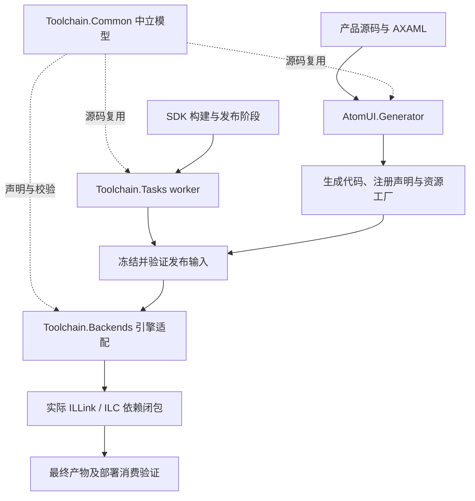

# Toolchain 设计思路与职责边界

入口：[模块概览](overview.md)。本文拥有 Toolchain 的组织原则和设计取舍；具体构建命令见
[构建、交付与验证](build-and-verification.md)，注册协议和引擎算法由相应架构与 Reference 文档拥有。

## 1. 为什么需要 Toolchain

AtomUI 除了编译控件，还需要生成主题资源包装、处理语言 Catalog、校验并打包构建资产，以及在发布阶段接入
不同版本的 ILLink/ILC。这些工作共享协议、工具身份和产物生命周期，应该由一个明确的源码模块维护。

此前构建任务、TypeMap 后端、net8 两个后端和共享绑定源码分散在多个顶层目录。问题不仅是目录数量：

- Generator 的构建依赖带上了发布后端，生成器打包又承担编译器工具准备，难以区分普通编译与发布成本。
- 公共协议位于某个任务工程中，其他引擎反向链接该工程的源码，协议所有者与执行宿主混在一起。
- 任务声明、后端准备和打包入口分散，单独构建可成功的后端不一定能被首次恢复、直接 pack 或真实 publish 正确消费。
- 维护者容易只验证已有缓存下的构建，遗漏新 profile 没有恢复、后端尚未准备或工具未进入包的问题。

Toolchain 将这些职责归到一个源码工程，通过少量明确入口管理其生命周期。名称覆盖编译辅助、链接适配、原生
编译器接入与打包准备；`Build.Tasks` 只适合描述其中的 MSBuild 任务部分。

## 2. 设计目标与不变量

1. 源码树和解决方案只有一个 Toolchain 工程，不按运行时版本、发布方式或单个任务继续增加顶层工程。
2. 普通产品编译只准备必要的 Tasks worker 和 Generator；引擎与原生编译器准备留在发布、打包路径。
3. 公共声明与校验只有一个源码所有者，编译到不同宿主时仍使用同一份实现。
4. 引擎依赖、恢复文件和输出相互隔离，不因工程合并而混用版本或上次发布结果。
5. 包消费者正常 restore 后使用包内工具；工具不进入产品 `lib/`、应用运行时依赖或部署目录。
6. 控件、Token、Style、资源工厂的条件保留精度与注册生命周期保持原契约。

“少一个工程”不能通过全量保留、吞掉诊断、跳过产物验证或隐藏依赖获得。代码简化应优先发生在重复配置、
公共模型归属和编排入口，实际引擎差异仍需在代码中清楚表达。

## 3. 一个工程为什么仍输出多个工具

源码组织和执行宿主是两个不同的边界。同一个 `.csproj` 通过 `AtomUIToolchainProfile` 选择所需源码与引用，
产出 Tasks、ILLink8 和 ILLink10 工具；ILC8 适配器及其构建配方也属于该模块。

ILLink8 与 ILLink10 使用不同版本的引擎 API 和 Cecil 上下文。把它们装入同一个全量程序集或同一个分析进程，
会把源码整理问题变成版本绑定与类型身份问题。Tasks worker 也没有必要承担这些引擎依赖。
因此保留独立工具产物，并明确各自产物的加载位置；旧 DLL 名称与 custom-step 入口继续作为内部交付契约使用。

ILC8 适配器需要在定版官方编译器的内部源码上下文中编译。维护者配方在隔离缓存中生成上游临时工程，
不在 AtomUI 的源码树或解决方案增加另一个工程。编译器 bundle 随工具交付，消费应用不执行这一步。

所有托管 profile 当前使用 net10.0 工具宿主。这不改变产品目标框架：在 .NET 10 上运行 ILLink8/ILC8 工具，
最终仍可输出使用官方 .NET 8 runtime/CoreLib 的应用。工具宿主、目标框架和 SDK 支持范围必须分别核验。

## 4. 职责和依赖方向

图中 Common 的箭头表示源码复用，不表示应用新增一个 Common 运行时程序集。

### Generator：生成编译事实

Generator 是 netstandard2.0 Roslyn Analyzer，受编译器加载环境约束，负责产生类型化注册、主题资源与语言相关代码。
它与 net10.0 的 MSBuild worker、链接器插件具有不同的加载要求，因此不纳入用户要求合并的五部分。
Generator 的 build-only 项目引用只准备 Tasks；共享模型通过 `Common` 复用，Generator 不拥有后端构建和 pack 准备流程。

### Tasks：管理构建输入和文件副作用

Tasks 负责资源包装、语言包、工具身份解析、输入快照、构建结果和发布副本校验。MSBuild 的薄适配器通过值协议调用
独立 worker，避免把工具程序集及其状态长期留在 MSBuild 节点中。worker 不加载应用程序集，也不发起消费项目的嵌套构建。

普通编译的语言语义校验由 Generator 拥有，Tasks 不保留另一套未接入构建入口的 Catalog 收集、语言文件验证任务。
主题与语言任务共用 `GeneratedTaskItem`，避免同一元数据规则在不同任务内分别维护。

`ToolBundleCache` 只负责工具文件集合的暂存、原子发布和完整性核对；各调用方仍拥有版本准入、缓存摘要、锁等待
策略及可执行权限。`RegistrationFiles` 统一文件摘要与原子写入，明确区分可替换阶段回执和仅能首次创建的 Native
证明。这些内部函数不合并各后端的分析状态，也不替代最终产物与发布副本的独立验证。

Repository targets 负责准备工具和衔接 SDK 阶段。它与 worker 的职责不同：源码仓库可以在发布前构建工具，
已安装 NuGet 包的消费者只运行已交付工具。跨项目接线由[构建与打包架构](../../architecture/foundations/build-and-packaging.md)拥有。

### Common：共享事实，不共享可达性状态

Common 保存严格协议、身份、快照和中立校验模型。Cecil 相关校验只编译到相应后端，Tasks 不因此获得 Cecil 依赖。
ILLink 的 marking 状态、ILC 的条件节点和生成代码图留在各自后端，不把它们抽象成另一套通用依赖分析器。

JSON 的重复字段遍历共用一处实现，候选记录仍启用严格标量约束；允许 null 或布尔值的报告不会因此改变候选 ABI。

### Backends：明确表达引擎差异

ILLink8 在实际 Mark 闭包中接入条件依赖；ILC8 在真实 scanner/codegen 图中接入条件节点；ILLink10 后端处理
Browser 的已选 TypeMap 物化和分析前的混合 ABI 桥接。普通 .NET 10 NativeAOT 的 TypeMap 选择仍由官方引擎完成。
一个适配器不能使用另一个引擎的较宽结果代替自己的最终选择。

## 5. 借鉴 Avalonia 的方式与边界

参考的是已核对的 Avalonia 源码提交 `0924260e71bac2b288ee2c168b773b8ed46b2995`，不是对后续版本的承诺：

- Avalonia 将 XAML 编译为创建对象、访问属性和构造资源的静态 IL，再由官方工具链处理后续发布。
  AtomUI 同样应优先输出清楚的类型化事实和静态调用，而不是增加运行时扫描。
  参见 [XAML 编译实现](https://github.com/AvaloniaUI/Avalonia/blob/0924260e71bac2b288ee2c168b773b8ed46b2995/src/Avalonia.Build.Tasks/XamlCompilerTaskExecutor.cs)。
- Avalonia 的聚合包工程统一分发 Build.Tasks、Generator 和 buildTransitive 资产。
  AtomUI 借鉴这种职责分离，将工具准备和打包收敛到 Repository 与 Toolchain 的明确入口。
  参见 [Avalonia 包工程](https://github.com/AvaloniaUI/Avalonia/blob/0924260e71bac2b288ee2c168b773b8ed46b2995/packages/Avalonia/Avalonia.csproj)。
- Avalonia 也在构建工具与生成器之间复用源码。共享源码本身不是缺陷；需要明确所有者、允许依赖的类型以及编译到哪个宿主。

不能把 Avalonia 的 AOT 兼容性当作 AtomUI 条件注册精度的替代证明。该版本的 Fluent 入口集中合并多种控件主题；
资源延迟创建不等于未使用的主题、工厂和注册会从产物中删除。
参见 [Fluent 主题集合](https://github.com/AvaloniaUI/Avalonia/blob/0924260e71bac2b288ee2c168b773b8ed46b2995/src/Avalonia.Themes.Fluent/Controls/FluentControls.xaml)。
因此工程收敛保留现有条件注册后端，不回退到集中完整主题集合。

## 6. 如何保持裁剪精度

Toolchain 的输入准备和协议校验只描述候选，不自行决定应用使用了哪些控件。实际 ILLink/ILC 依赖闭包决定选择，
运行时执行已经确定的片段。注册冻结、资源覆盖顺序、异常与失败状态继续遵守
[Control 注册契约](../../architecture/foundations/control-registration-contracts.md)。

重构必须同时验证应保留与应删除的内容。例如，只使用 Button 的样例必须运行正确的模板，并证明未使用的 Calendar
及相关注册没有被重新保留；Token-only、Style-only、AXAML 传递资源和无 scanner 模式也不能通过删除场景来规避。
source hash 相同可以证明算法文件未修改，但不能替代冷构建、工具分发和真实产物执行的验证。

未知 ABI、工具版本冲突、缺后端、错误输入身份或过期回执应明确失败。保留完整集合来让发布通过，会改变产品语义，
不属于本模块允许的简化手段。具体协议和适用矩阵见[条件注册 ABI](../../reference/aot/conditional-registration-contract.md)
与 [AOT 验证门槛](../../architecture/foundations/aot-and-trimming.md#8-验证与交付门槛)。

## 7. 后续演进原则

新增普通构建任务先归入 Tasks，共用模型先归入 Common；只有存在真实引擎或加载边界时才增加内部 profile。
不要为一个功能再增加顶层工具工程，也不要为了减少文件数把不同引擎状态、文件副作用与协议解析放进一个大类。

选择更简单的实现时，保留协议、输入隔离、最终输出校验和可定位的失败信息。工具包拆分、引擎升级或支持平台扩展
都需要各自的恢复、分发和执行证据；源码目录收敛本身不关闭这些门槛。
