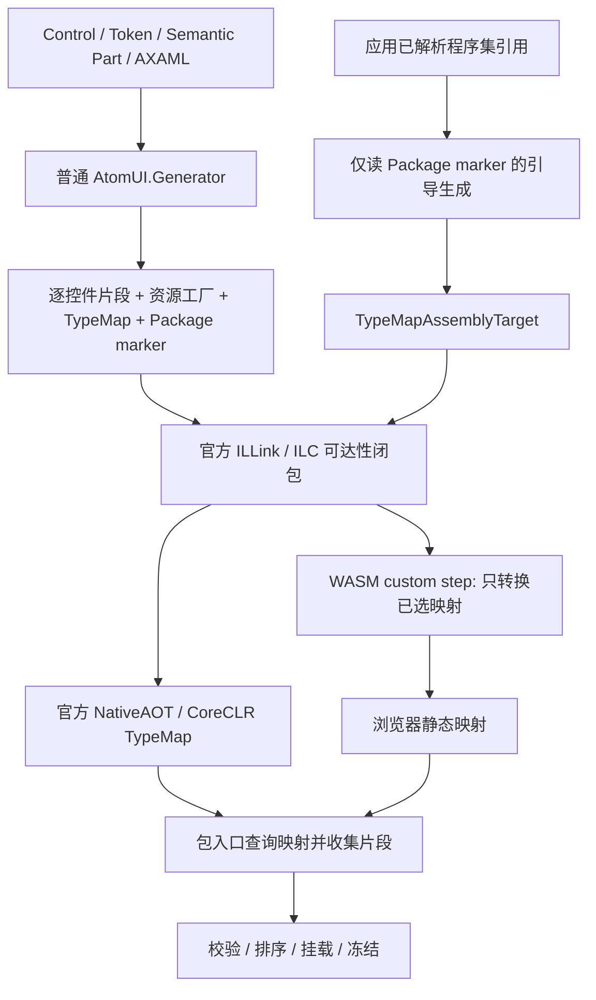

# AtomUI TypeMap 注册体系替换设计

> 过程记录：本轮结论已同步到 [正式 AOT 架构](../../architecture/foundations/aot-and-trimming.md)。本文保留方案比较、实验或迁移过程，不再作为平行的长期规范；事实以正式文档为准。


> 2026-09-27，全局复评后的设计稿，待评审，不是已实现的产品架构。
> 用户要求：保留一行入口、自动精细裁剪、第三方正常开发无 AOT 专用配置、浏览器同样精细裁剪；不保留历史兼容负担。
> 目标是一次完成替换后删除旧注册分析体系，不长期并存两套自动依赖推导。

## 1. 决策与证据等级

采用一个普通注册生成模型，两个发布后端：

- NativeAOT/CoreCLR：使用官方 TypeMap。
- Mono/WASM：官方 ILLink 完成 TypeMap 标记闭包后，由 AtomUI 的窄范围 custom step 把自己的 map accessor 转换为静态映射。

WASM 后端不是 BCL 原生支持 Mono，也不是运行时扫描残留 Attribute。它使用有官方文档的编译器扩展入口，但必须绑定并验证工具链版本。

已验证：真实 AtomUI 桌面 NativeAOT 启动、Token、三个模板、Button 语义描述、暗色切换与冻结；独立浏览器程序的裁剪运行与真正
`RunAOTCompilation=true` 发布都保留已用/间接依赖、删除未用类型。尚未验证：本稿全部逐控件模型、完整 Browser Gallery、NuGet 冷消费及全量产品迁移。

所以当前结论是“关键机制可执行，可以进入完整实现”，不是“现在就能安全删除生产旧路径”。

## 2. 设计文件

- [类型、Token、语义和资源契约](2026-09-27-aot-typemap-contracts-design.md)
- [浏览器链接后端及实验](2026-09-27-aot-typemap-browser-backend-design.md)
- [删除范围、迁移与验收](2026-09-27-aot-typemap-retirement-design.md)
- [此前的真实 AtomUI 深入验证](2026-09-27-aot-typemap-validation.md)

本稿取代早期按现有 Unit 套 TypeMap 的探索设计。日期化实验记录保留，不改写为完成状态。

## 3. 系统结构



删除应用 usage 扫描、跨消费程序集的 Sidecar、UnitEdge、应用 SCC/closure、Application Plan 和 PlanRegistry。
不引入多轮 linker、自定义 C# 调用图、运行时依赖图或同名资源的全局依赖推断。

## 4. 粒度从目录变为实际契约

不保留 `Package` / `Directory` 粒度、`AotTrimUnit` 或目录归属作为裁剪依据。

生成一个 ControlRegistrationFragment 需要该类型至少拥有一项真实内容：Token 契约、Semantic Part 契约、导出的主题资源。
它可包含可选 descriptor 和资源引用；internal 控件可只有资源，无需公开 Token identity。

同一资源字典导出多个 ControlTheme 时，保持整个字典为不可分割资产。任一导出 Control 可达会保留 factory，factory 的真实引用
使其他所需类型进入官方闭包。多个片段添加同一 AssetId 只挂载一次。包只表达 provider、初始化顺序、语言和真正公共资源，不再决定裁剪粒度。

Common 也进入新模型：`UseCommonControls` 的图片服务、codec、语言保留为 Package Core，公共控件/主题按契约选择。
Core 的全局 Token/算法、Localization、字体和原生资产沿用各自静态机制；本次不删除正确的数据访问器生成或声称 TypeMap 能裁剪任意原生文件。

## 5. 条件映射与代理

每个具体保留条件使用唯一 key；不能对同一个 key 声明多个 trimTarget，即使 target proxy 相同。
官方尚不支持这种 OR 声明，NativeAOT 实验会抛 BadImageFormatException。

```csharp
// 生成代码；具体 key 格式由生成器统一定义。
[assembly: TypeMap<DesktopMap>("Button/control", typeof(ButtonRegistration), typeof(Button))]
[assembly: TypeMap<DesktopMap>("Button/token", typeof(ButtonRegistration), typeof(ButtonTokenResourceExtension))]
[assembly: TypeMap<DesktopMap>("Button/style-content", typeof(ButtonRegistration), typeof(ButtonContentStyle))]
```

代理是带自身 Attribute 的 sealed 类型，继承 Core 的隐藏 `ControlRegistrationFragmentAttribute`，只添加自己的契约和资产。
使用已知的 `GetCustomAttribute<ControlRegistrationFragmentAttribute>` 激活；不对未知 Type 做反射构造函数搜索。
条件 TypeMap 声明自身的 IL2026 以局部、带理由的生成代码处理；不得全局关闭 IL2026/IL3050。

TypeMap 不支持枚举。生成纯字符串候选 key 表，逐项 TryGetValue，先按 proxy Type 去重，再读取 Attribute。
候选表不能包含 Control Type、代理实例或工厂 delegate。先使用这一最简单、已测的形式；不为省少量查询引入不受支持的同键技巧。

每个包生成具体闭合的 `GetOrCreateExternalTypeMapping<PackageMap>()` 调用。共享 Runtime 只接收取得的 dictionary，不在泛型
`ReadMap<TGroup>()` 中查询，以免 IL2124。

## 6. 第三方与应用接口

应用保持：

```csharp
builder.UseDesktopControls().UseAcmeControls();
```

第三方无状态入口只需正常注册 Provider：

```csharp
public static IAtomUIBuilder UseAcmeControls(this IAtomUIBuilder builder)
    => GeneratedControlPackageRegistration.Register(
        builder, static () => new AcmeControlThemesProvider());
```

有生命周期逻辑时，生成入口接受明确的 provider factory、prepare 和 complete 回调；不解析方法体猜顺序。
作者不写 TypeMap、AotTrim 分支、入口身份 Attribute、方法名字符串、Unit、Sidecar、linker XML 或 AOT 控件名单。
Package identity 仍是正常的资源身份，默认由 PackageId/AssemblyName 推导，可按普通包身份规则固定；不是 AOT 配置。

SDK 自动携带普通生成器与构建资产。NuGet 编译交付 TypeMap 与 marker，应用编译自动完成 assembly target 引导；预编译普通
consumer DLL 不需要使用清单，只需能够解析它引用的、使用新 SDK 构建的控件包。

“无感”覆盖标准编译型 AXAML、正常 Control/Token/Style 与静态工厂。任意运行时类型名、动态生成代码、发布后插件仍遵守
.NET AOT 限制，不以隐藏保留全包来伪装精细裁剪。

## 7. Package marker 与 bootstrap

包输出隐藏公共 Group 类型，以及携带 Package ID、Group 类型和 ABI 标识的 assembly marker。
Group 不得拥有引用全包 descriptor/factory 的静态字段。公开仅为跨程序集生成代码可引用，非用户扩展点。

应用生成器只读取已解析引用的 assembly marker，按程序集身份确定性去重，输出 `TypeMapAssemblyTarget<ConcreteGroup>`。
不读取用户 C#/AXAML 方法体，不要求 ProjectReference 在 publish 时携带额外属性重建，不产生 companion 文件。

marker/target 声明不是启用动作：不能自动创建 Provider、注册语言或运行 initializer。真正的包入口仍是唯一启用动作。
重复包身份、错误 Group/ABI、缺失引用在普通编译或启动时给明确错误；不恢复旧的消费者 IL 扫描。

## 8. Runtime 注册时序与失败语义

```text
检查 builder/重复或递归注册
→ prepare（保留显式基础包调用顺序）
→ 创建 Provider / 平台过滤
→ 收集 shared core + 选中片段
→ 检查包内重复身份和记录结构
→ 暂存 ControlPackageRegistration 与资源 factory
→ complete（语言与 initializer）
→ 所有入口完成后统一跨包校验、资源排序/挂载与冻结
```

使用当前 AtomUIBuilder 的实例状态扩展机制，不建持有 builder/provider 的静态缓存。
本次不顺便改变公开重复注册契约：同一 builder 的第二次公共包入口在 prepare 前报错，避免重复执行服务/配置回调；递归进入
正在注册的同包也报错。框架基础包依赖若需要 Ensure 语义，必须作为内部明确操作，与公共重复 Use 区分。
不同 builder 独立。注册失败使该 builder 不能继续 Build 成一个部分成功的应用；不能 catch 后重试 full registrar。

包提交只检查自身可证明的不变量，不要求后续包的 Token/资源 owner 已注册。
跨包 RequiredTokenOwners、语义依赖和完整 schema 的校验在 configure 返回后的 Build/InitializeApplication 阶段执行。
资源 factory 延迟到全部包的片段收集之后执行；Theme registry、Semantic registry 和 Token slots 在首次控件实例化前固定。
包提交时分配稳定的 PackageCommitOrdinal，保留 Common 在 Desktop 前、明确扩展包在基础包后的真实挂载顺序。
主题切换和 scoped Token 不增删注册项，只使用已经冻结的 schema。

## 9. 一个事实源，三种执行模式

| 模式 | 执行 |
| --- | --- |
| 普通非裁剪运行，包括浏览器 Debug | 直接提交全部片段，仍使用同一单项 factory 和资源排序 |
| NativeAOT / trimmed CoreCLR | 官方 TypeMap 选中片段 |
| Browser trimmed interpreter / Browser AOT | 官方 ILLink 标记 + 编译期映射转换，选中片段 |

非裁剪全量是未启用裁剪时的正常行为，不是浏览器发布失败兜底。
完整/选中分支由一个官方 linker feature switch 决定；发布必须证明 full 分支未意外 root 全包。
不根据 C# 的 Debug/Release 编译常量决定包内选择，因为同一 NuGet 必须支持不同消费发布模式。

最低产品 TFM 收敛到 net10.0，不携带 net8/net9 旧实现。Browser 继续 net10.0-browser。
精确支持工具链组合由自动构建资产检查，用户不手配 backend。未验证的 linker ABI、缺少转换步骤或残留 slot 均阻止发布。

## 10. 动态边界和诊断

静态工厂、typeof、已知反射类型参数沿用官方标注规则。对必须保留的动态控件，可提供正常的类型化 root/工厂注册，真实保存并校验
Control Type；不保留旧的 UnitRoot/PackageRoot 字符串协议，也不承诺任意字符串能自动保留类型。

旧 ATOMUILINK008 依靠应用使用分析，不能原样保留。新设计在普通包生成期检查结构契约，启动时验证所有选中资源/Token/语义依赖。
若使用可选控件而未启用包，报告明确缺包/主题错误，不自动启用包。不能为了复刻一个旧诊断重新引入跨 DLL 应用分析。

新诊断使用项目统一注册表分配 ID；旧 LINK ID 标记废弃、不复用。重点错误：模糊主题导出、错误 Token owner、不可访问的注册
类型、非法资源包含、身份冲突、无效后端、未转换 slot。普通宿主 DynamicResource 不被误判为需要全包保留。

## 11. 删除批准门槛

同时满足以下条件，才可在同一迁移中彻底删除旧体系：

1. 类型/资源契约正式实现及单元测试通过，包含本文两处实际源码资源陷阱。
2. Desktop NativeAOT、trimmed CoreCLR、Browser 裁剪运行和 Browser AOT 的真实 AtomUI 宿主均通过。
3. source/direct/transitive/binary/NuGet cold-consumer 路径通过；第三方只用正常入口，不写任何 TypeMap。
4. Common、Desktop、DataGrid、ColorPicker、Extras、GalleryBase 的生命周期与可选启用契约通过。
5. 固定 SDK/RID 的体积、构建成本与 unused-control 增量达到验证门槛。
6. pack/构建产物和仓库扫描证实没有旧 analyzer、Sidecar、Plan 或旧 MSBuild 传播逻辑。

本稿没有批准直接删除当前生产旧实现；当前批准的是方向，正式实现必须按验收证据推进。

## 12. 独立设计审查

本轮独立审查提出的四项实质问题已修订并复审闭合：跨包 freeze 时机、identity 去重前 owner 信息保留、开放 DynamicResource
与无关同名私有资源的区分、链接闭包循环与资源构造循环的区分。没有发现必须推翻新路线的机制性障碍。
这项结论允许推进正式实现，不替代第 11 节的产品删除门槛。
