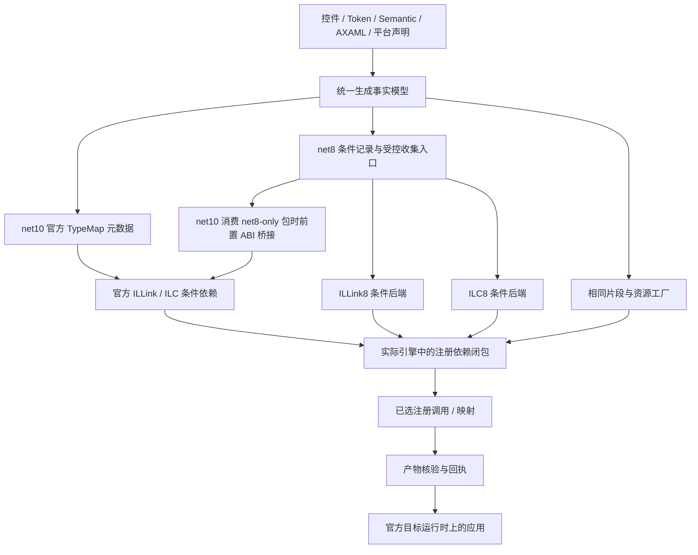

# AtomUI 多目标 AOT 依赖分析架构方案

**状态：正式评审稿，待用户 Review；不表示产品实现或发布验收已经完成。**
日期：2026-10-05。范围：产品库 net8.0/net10.0 的注册依赖分析、托管裁剪、NativeAOT 和构建交付。

本文替代此前[可行性与接入草案](../2026-10-05-net8-conditional-registration-backend-design.md)作为本轮设计评审入口。
历史版本包内容保持历史事实；本方案批准前，不改写现有架构的实现状态或发布结论。

## 1. 评审结论与目标

建议采用**同一注册事实模型、按目标框架与执行引擎选择后端**的架构：

- 产品库 Debug 只构建 net10.0；Release 同时交付 net8.0 和 net10.0。
- .NET 10 保留官方 TypeMap；.NET 8 的裁剪选择进入实际 ILLink/ILC 依赖闭包。
- .NET 8 NativeAOT 使用定版编译器适配，运行时与 CoreLib 保持官方 .NET 8 资产。
- 不以全量注册、源代码 usage 扫描、预编译 DLL 猜测、目录保留或 ILLink 预分析代替 NativeAOT 分析。
- 控件公开使用方式、资源作用域、主题覆盖、初始化顺序和注册冻结保持一致。

最小原型已证明上述机制可实现。正式支持还必须通过真实 AtomUI ABI、AXAML、多程序集、泛型、编译模式和平台验收。
特别是**原型仅支持 scanner-enabled NativeAOT；无 scanner 模式属于必须补齐的产品门槛**，不能作为默认排除项。

## 2. 方案文档与所有权

| 文档 | 所拥有的设计 |
| --- | --- |
| [契约与元数据](contracts.md) | 统一事实、身份、片段、候选记录、生成 ABI、注册生命周期和动态边界 |
| [分析后端](backends.md) | 闭包模型、ILLink8/ILC8 接入、预初始化、物化阶段与 .NET 10 保持策略 |
| [构建与工具交付](build-and-delivery.md) | 模式选择、工具包、冷恢复、身份校验、增量与并发、发布产物 |
| [验证与落地](verification-and-rollout.md) | 通过标准、反例矩阵、里程碑、迁移、风险和评审决策 |
| [原型证据](evidence.md) | 已证明范围、失败前后证据、与 .NET 10 对照及尚未证明的边界 |

已有[控件注册契约](../../../architecture/foundations/control-registration-contracts.md)继续拥有 Control/Token/Semantic/Theme
业务语义；[资源与注册生命周期](../../../architecture/foundations/aot-and-trimming.md#6-注册生命周期)继续拥有事务、冻结与清理。
本方案定义多目标分析接线，不另建第二套控件或主题事实来源。

## 3. “同等能力”的可验收定义

| 维度 | 必须满足 |
| --- | --- |
| 分析依据 | 对应实际发布引擎的 IL、类型、数据流、平台与特性开关；不退回源代码可见性推测 |
| 条件粒度 | Control、Token、typed Identity、Semantic Style 等真实条件能分别触发对应片段 |
| 闭包 | 片段、已编译 AXAML 与资源 factory 引入的依赖继续参与同一标记闭包 |
| 去除效果 | 未用条件、片段、factory 和可独立删除的资源不被候选目录或注册表提前根化 |
| 运行契约 | 被保留控件的模板、资源、主题切换、语言、事件与初始化/冻结结果正确 |
| 消费边界 | source、直接/传递 ProjectReference、NuGet、预编译消费 DLL 均有真实证据 |
| 失败语义 | 不认识的 ABI/工具链、缺失结果、不完整闭包和陈旧输出明确失败，无全包兜底 |

不同框架 BCL、编译器优化和平台实现不要求最终二进制逐字节相同。对共享产品语义场景，应对照所选片段和可观察行为；
引擎优化产生差异时必须解释到具体依赖路径，并符合该引擎的条件语义。不能用“不同版本”豁免漏注册或无理由的整包保留。

## 4. 总体数据流

依赖方向固定：业务事实 → 条件依赖 → 引擎闭包 → 已选注册 → 运行时提交。运行时不反向扫描程序集或补建使用清单。
候选记录仅描述可能的关联；引用一个包、读取候选记录或观察到某个类型名都不能自动启用整个包。

## 5. 模式与平台边界

| 消费模式 | net8.0 | net10.0 |
| --- | --- | --- |
| 普通 build/run、未裁剪 Release | 正常完整注册；无额外依赖分析 | 现有正常完整注册 |
| CoreCLR trimmed | ILLink8 条件后端 | 官方 TypeMap |
| Desktop NativeAOT，scanner enabled | ILC8 图内条件边及已选 dispatch | 官方 TypeMap |
| Desktop NativeAOT，scanner disabled | 原生闭包后端必须补齐并验收；见后端设计 | 现有官方路径及相应回归 |
| Browser trimmed / WASM AOT | 本方案不新增 net8 Browser 宿主 | 保留 net10.0-browser 与现有转换后端 |
| Mobile 产品包/平台发布 | 不由库的 net8 TFM 推导支持承诺 | 沿用项目已有平台边界 |

表中的 net10 官方路径也覆盖消费 net8-only 包：先在隔离副本中转换候选 ABI，再由官方引擎分析。
这条[混合包桥接](backends.md)尚未完成验证，属于 P2 必须通过的门槛。

产品库的 Debug TFM 与消费应用的 Debug 配置是两件事。net8 Debug 应用可以使用已发布的 net8 Release 库。
源码 ProjectReference 若使用不兼容的库 Debug 配置，应给出配置错误；不暗中为产品库 Debug 增加 net8。
生成器、语言包、构建 worker、开发工具和性能工具保持各自明确目标，不继承产品库双 TFM 策略。

## 6. 核心决策

| ID | 决策 | 原因 |
| --- | --- | --- |
| D01 | 共享事实和片段，分离目标后端 | 保持资源/API 一致，避免两套生成规则漂移 |
| D02 | net8 候选以构建专用字符串元数据嵌入程序集 | 支持预编译/NuGet 消费，不提前建立 CLR 类型根 |
| D03 | .NET 8 NativeAOT 接入 ILC 本身 | ILLink 选择集不能替代 ILC 选择集 |
| D04 | 优先普通强类型静态注册 dispatch | 原型证明可避免 CoreLib 修改和运行时发现 |
| D05 | 未支持的编译模式阻止交付，不降级 | “能运行但整包保留”不满足要求 |
| D06 | 工具身份按已验收组合校验 | 版本相近不等于内部编译器 ABI 兼容 |
| D07 | 结果与输入、工具、最终产物绑定 | 防止缓存、并行 TFM 或旧输出伪造通过 |
| D08 | 不提交/发布临时原型与全量注册替代实现 | 当前草稿只证明普通 net8 运行 |
| D09 | 按引擎与输入包 ABI 组合选择/桥接 | net10 必须正确消费 net8-only 第三方包 |

## 7. 组件分工

| 组件 | 正式职责与改动边界 |
| --- | --- |
| AtomUI.Generator | 共用事实；生成 net10 TypeMap 与 net8 记录/入口；普通编译校验身份和资源 |
| AtomUI.Core | 保持 Builder/事务/冻结；承载版本化隐藏生成 ABI；不加入运行时程序集发现 |
| AtomUI.Build.Tasks | 解析工具与输入、模式门禁、回执及最终消费校验；不发起嵌套 restore/build |
| AtomUI.Registration.ILLink8（拟新增） | 定版 MarkStep 扩展，闭包内加边，Mark 后物化与产物检查 |
| AtomUI.Registration.ILC8（拟新增） | 定版编译器适配、条件节点、预初始化屏障、dispatch/原生输出与报告 |
| AtomUI.TypeMap.Linker | 现有 net10 Browser 转换职责保持独立 |
| build / scripts | 选择后端、严格产物矩阵、打包工具白名单与验证组合 |

新增名称属于拟定模块名，不表示项目已经创建。正式目录、包资产和 ABI 由后续文档明确，当前评审不批准发布任何版本。

## 8. 建议评审重点

1. 是否接受维护定版 .NET 8 编译器适配及其 servicing 成本。
2. 是否认可“无 scanner 能力必须补齐后才能声明完整支持”的发布约束。
3. 是否认可候选记录嵌入程序集、静态 dispatch 优先、工具内聚交付的初版方案。
4. 是否认可 net10 消费 net8-only 包的分析前桥接及其隔离、身份与回归要求。
5. 是否认可按[落地门槛](verification-and-rollout.md)推进，机制原型与产品验收分别结案。
